===

# 🛒 E-Commerce Microservices Platform

A production-shaped e-commerce platform built with **Spring Boot 4 + Spring Cloud + React 18**, featuring 5 microservices with service discovery, API gateway, JWT authentication, role-based access control, and full Docker orchestration.


[](https://github.com/KhaldounDamach2/kh-ecommerce-microservices/actions/workflows/ci.yml)

---

## 📸 Screenshots

### Customer Flow

| Home                                  | Products                                      | Product Detail                                     |
| ------------------------------------- | --------------------------------------------- | -------------------------------------------------- |
| 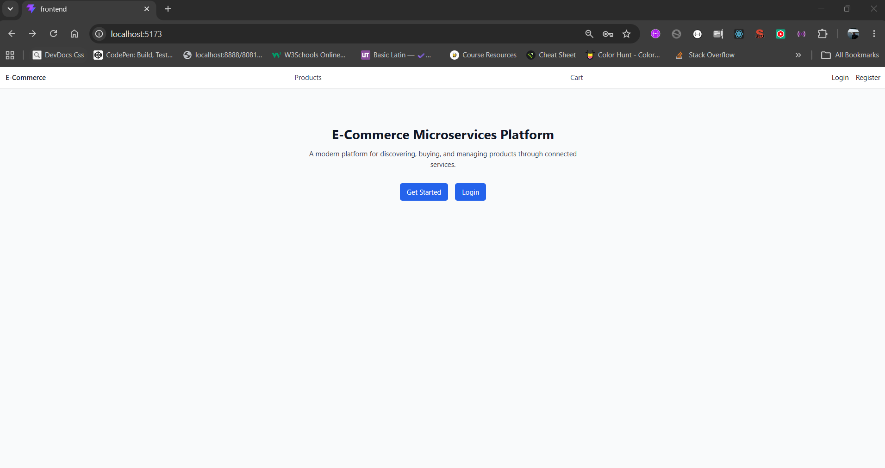 | 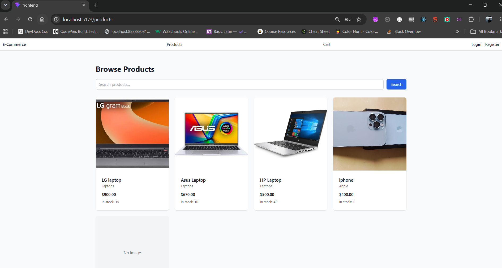 | 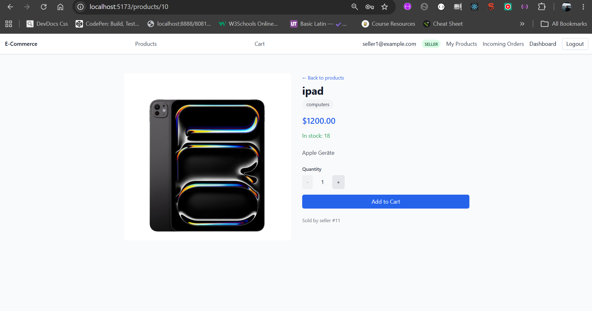 |

| Cart                                  | Checkout                                      | My Orders                                    |
| ------------------------------------- | --------------------------------------------- | -------------------------------------------- |
| 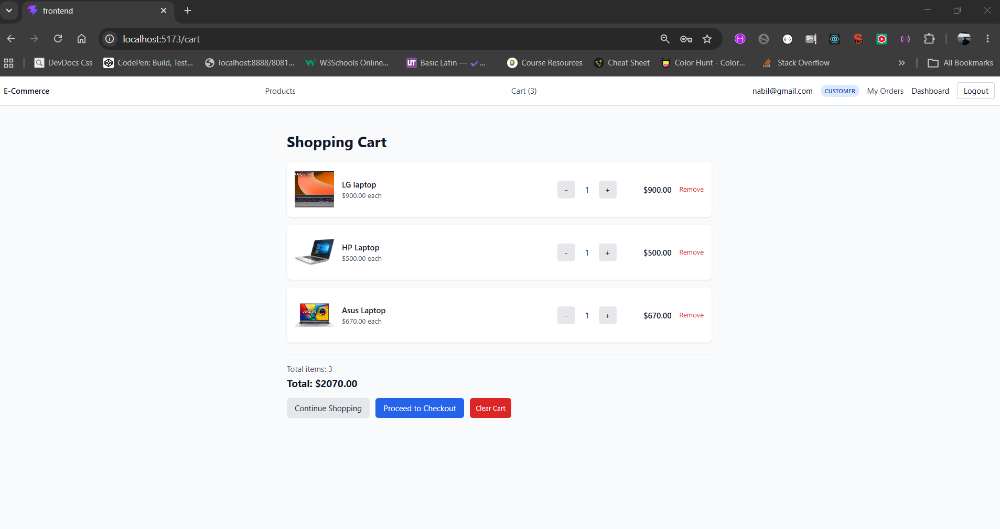 | 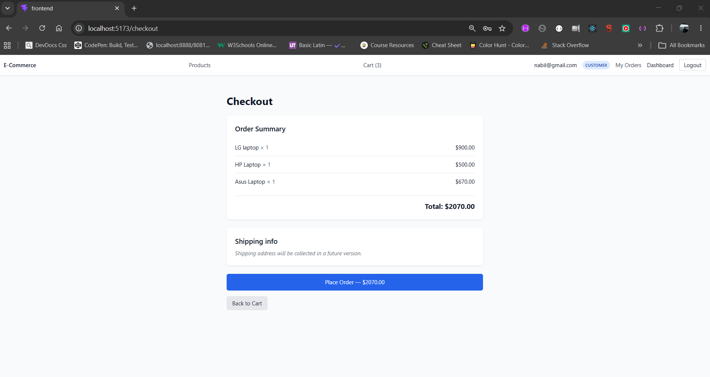 | 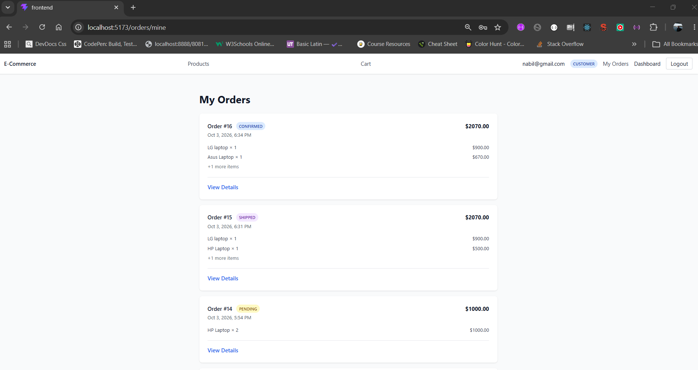 |

### Seller Flow

| Seller Products                                    | Product Edit                                  | Order Details                                   |
| -------------------------------------------------- | --------------------------------------------- | ----------------------------------------------- |
| 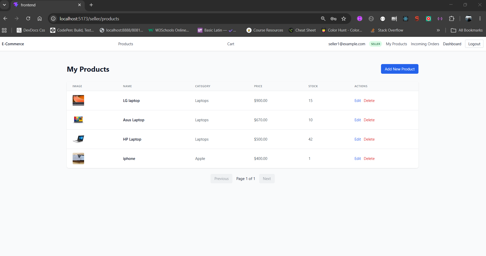 | 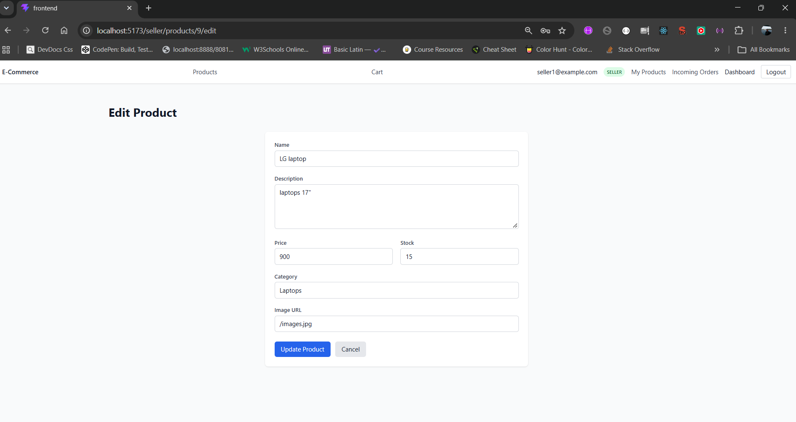 | 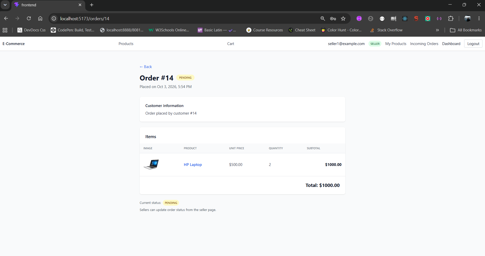 |

| Product Status                                           |     |     |
| -------------------------------------------------------- | --- | --- |
| 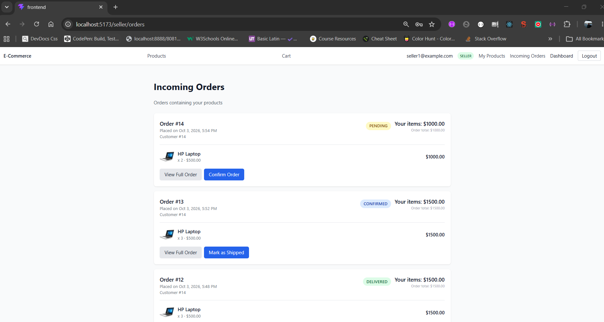 |     |     |

### Infrastructure & Observability

| Eureka Dashboard                          | Grafana (JVM Metrics)                                 | Prometheus Targets                                        |
| ----------------------------------------- | ----------------------------------------------------- | --------------------------------------------------------- |
| 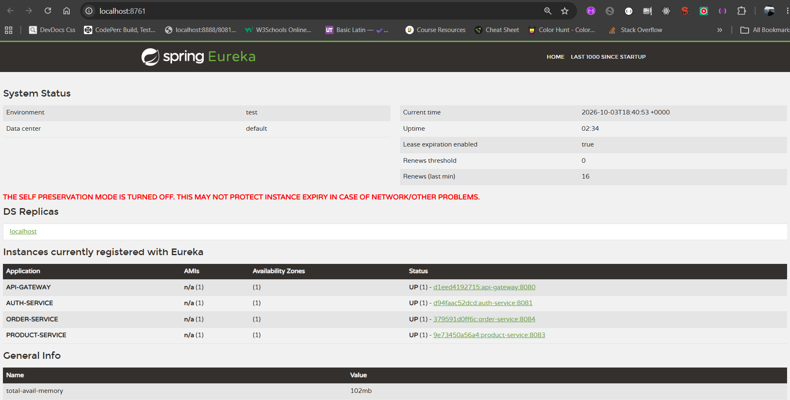 | 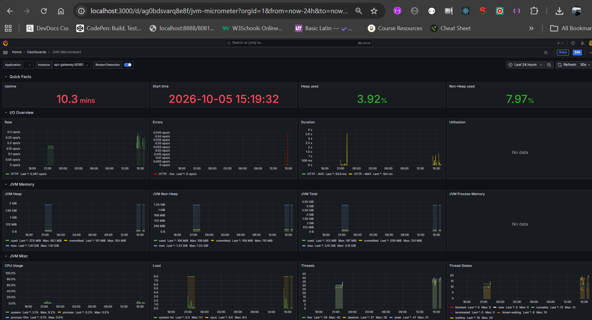 | 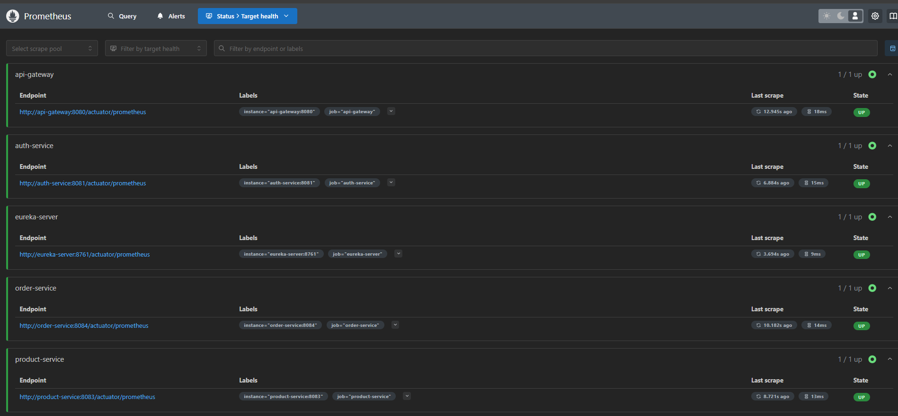 |

| GitHub Actions CI                          |
| ------------------------------------------ |
| 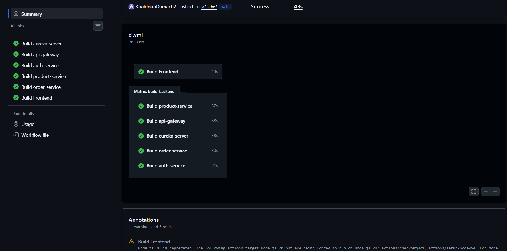 |

---

## 🏗️ Architecture

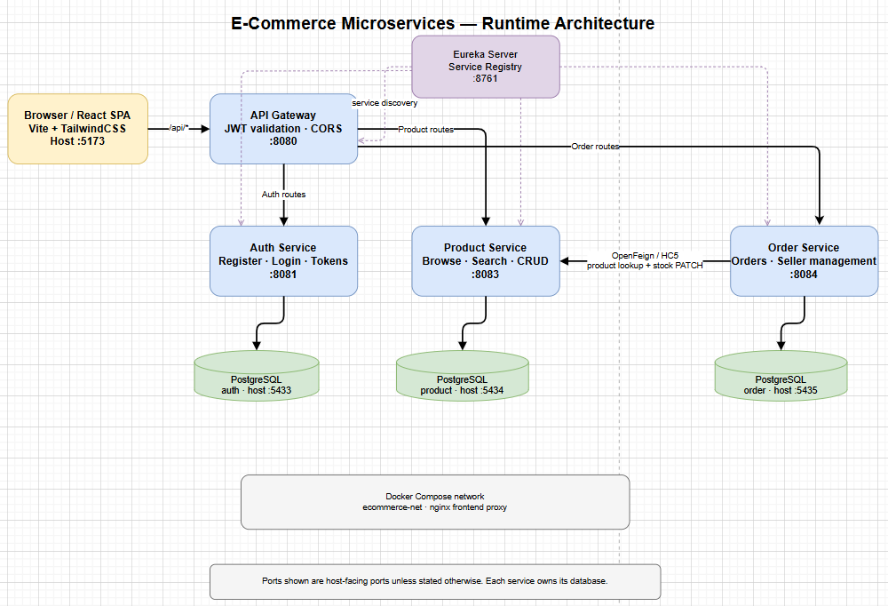

**5 Spring Boot services** behind an **API Gateway**, all registered with **Eureka** for service discovery. Each service owns its own **PostgreSQL** database (database-per-service pattern). The frontend is a React SPA served by nginx, which proxies `/api/*` to the gateway.

| Service             | Port | Purpose                                                | Database               |
| ------------------- | ---- | ------------------------------------------------------ | ---------------------- |
| **eureka-server**   | 8761 | Service registry                                       | —                      |
| **api-gateway**     | 8080 | Edge routing, JWT validation, CORS                     | —                      |
| **auth-service**    | 8081 | Register, login, JWT issue/refresh, email confirmation | postgres-auth :5433    |
| **product-service** | 8083 | Product CRUD (SELLER), browse/search (all), stock      | postgres-product :5434 |
| **order-service**   | 8084 | Order placement, history, seller management            | postgres-order :5435   |
| **frontend**        | 5173 | React SPA                                              | —                      |
| **prometheus**      | 9090 | Metrics collection & time-series storage               | —                      |
| **grafana**         | 3000 | Metrics visualization & dashboards                     | —                      |

---

## 🚀 Quick Start

### Prerequisites

- Docker Desktop (or Docker + Docker Compose)

### Run the entire stack

```bash
git clone <your-repo-url>
cd kh-ecommerce-microservices

# Create .env from template
cp .env.example .env
# Edit .env with your values (JWT secret, Mailtrap credentials)

# Start everything
docker compose up -d

Wait ~60 seconds, then:

Service	URL
🖥️ Frontend	http://localhost:5173
📋 Eureka Dashboard	http://localhost:8761
🔌 API Gateway	http://localhost:8080/api
📊 Prometheus	http://localhost:9090
📈 Grafana	http://localhost:3000 (admin/admin)
❤️ Auth Health	http://localhost:8081/actuator/health
❤️ Product Health	http://localhost:8083/actuator/health
❤️ Order Health	http://localhost:8084/actuator/health
Stop
bash
docker compose down
Stop and delete data
bash
docker compose down -v
📊 Monitoring
Prometheus scrapes metrics from all 5 Spring Boot services; Grafana visualizes them.

Component	Purpose	URL
Prometheus	Metrics collection, time-series storage (15s scrape, 15d retention)	http://localhost:9090
Grafana	Dashboards & visualization (provisioned Prometheus datasource)	http://localhost:3000
Every service exposes /actuator/prometheus via Micrometer. Prometheus discovers targets by Docker container name (eureka-server:8761, api-gateway:8080, auth-service:8081, product-service:8083, order-service:8084).

Recommended dashboard: import Grafana dashboard ID 4701 (JVM (Micrometer)) via Dashboards → New → Import.

🚀 CI/CD
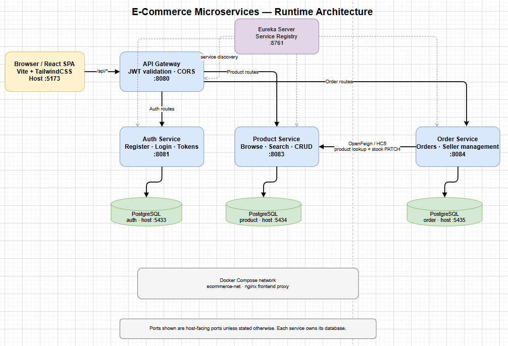

GitHub Actions runs on every push to main: builds all 5 Spring Boot services in parallel (matrix strategy), runs unit tests, and builds the frontend. When everything is green, a notify job publishes a deployment signal artifact.

Continuous deployment runs on the deployment VM via a polling script + cron:

Every 5 minutes, the VM queries GitHub's public API for the latest successful ci.yml run on main

If the latest green commit differs from the VM's local HEAD, it pulls and runs docker compose up -d --build

If checks are still pending or failing, it skips (CI-gated deployment)

This design works without a public tunnel or SSH secrets — the VM polls GitHub, so the NAT/firewall constraints of a local VirtualBox deployment are irrelevant.

Component	File	Purpose
CI workflow	.github/workflows/ci.yml	Matrix build + tests + deployment signal
Deploy script	~/ci-deploy.sh (on VM)	Polls GitHub, verifies checks, deploys on green
Cron entry	crontab -l on VM	Runs deploy script every 5 minutes
Note: This is a recreate deployment (short downtime during each deploy). For zero-downtime, blue-green deployment would be the next step.

🔐 Authentication & Authorization
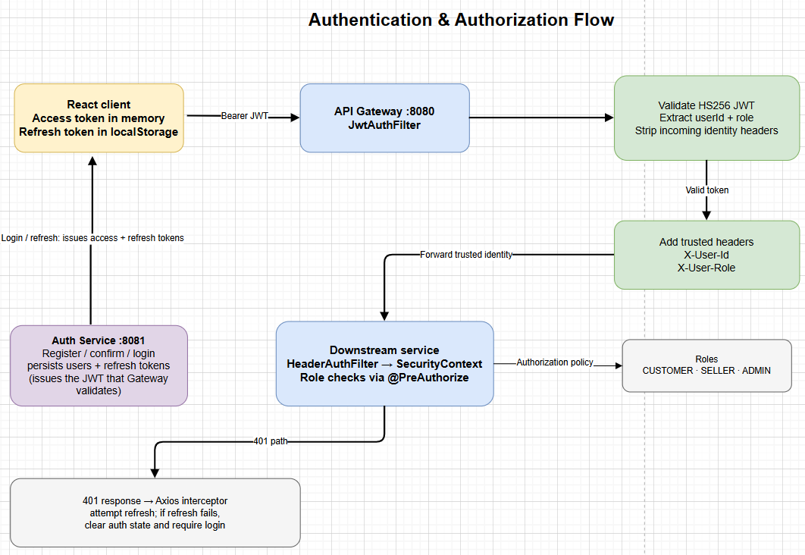

JWT validated at the API Gateway — single point of auth.

Flow
Browser → Gateway with Authorization: Bearer <JWT>

Gateway's JwtAuthFilter:

Skips public paths: /api/auth/register, /login, /confirm, /refresh, /logout

Validates JWT signature (HS256)

Extracts userId and role

Strips any incoming X-User-Id/X-User-Role headers (anti-spoofing)

Adds trusted X-User-Id and X-User-Role headers downstream

Services trust these headers via HeaderAuthFilter → Spring Security context

@PreAuthorize("hasRole('SELLER')") enforced at service level

Roles
Role	Permissions
CUSTOMER	Browse products, place orders, view own orders
SELLER	Manage own products, view incoming orders, update statuses
ADMIN	Manage all users, products, orders
Registration
POST /auth/register → save user (enabled=false) → send confirmation email

User clicks link in email → POST /auth/confirm → enabled=true

Only enabled users can log in

Tokens
Access token: 15 min (dev: 1h via local profile override)

Refresh token: 7 days

Access token in memory (React state)

Refresh token in localStorage

Axios interceptor auto-refreshes on 401

🗄️ Data Model
auth-service
users (id, email, password, role, enabled, timestamps)

confirmation_tokens (id, token, user_id, expires_at, confirmed_at)

refresh_tokens (id, token, user_id, expires_at, revoked)

product-service
products (id, name, description, price, stock, category, image_url, seller_id, active, timestamps)

Soft delete via active=false

Indexes on seller_id, category, name, active

order-service
orders (id, customer_id, total_price, status, timestamps)

order_items (id, order_id FK, product_id, product_name, product_image, seller_id, unit_price, quantity, subtotal)

Snapshot pattern: order items store product data at order time

State machine: PENDING → CONFIRMED → SHIPPED → DELIVERED

🔌 Inter-Service Communication
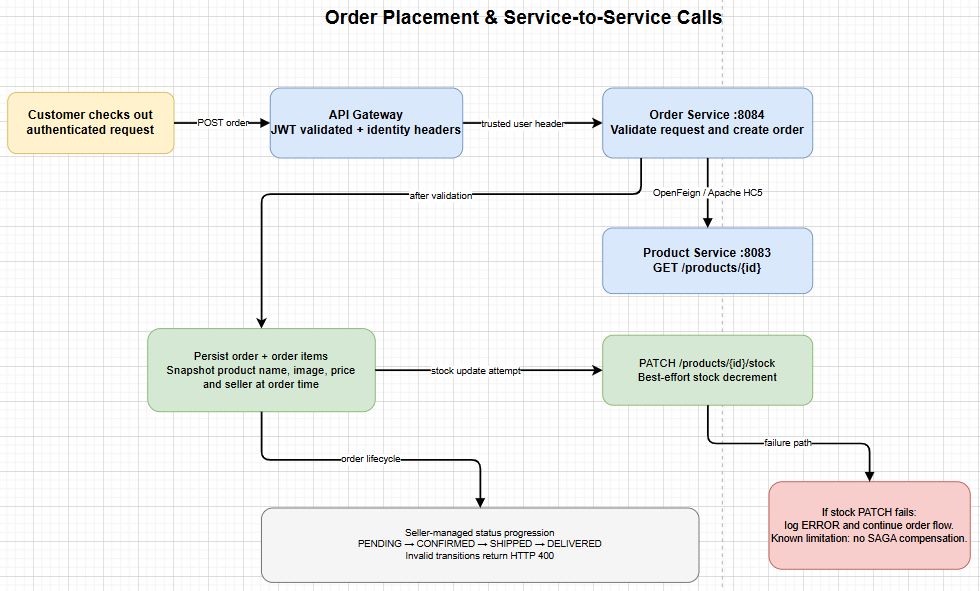

OpenFeign + Apache HC5 (for PATCH support).

order-service → product-service:

GET /products/{id} — fetch product for validation

PATCH /products/{id}/stock — decrement stock after order placed

Header propagation: FeignConfig.RequestInterceptor forwards X-User-Id/X-User-Role automatically

Best-effort stock decrement: failures are logged, don't break order placement

🛠️ Tech Stack
Backend

Java 21

Spring Boot 4.1.1

Spring Cloud 2025.1.3 (Eureka, Gateway, OpenFeign)

Spring Security 6 + JWT (JJWT 0.12.6)

Spring Data JPA + Hibernate

Flyway migrations

MapStruct 1.6.3

PostgreSQL 16

Lombok

OpenFeign + Apache HC5

Frontend

React 18 + Vite 8

React Router v6

Axios (interceptors for JWT + auto-refresh)

TailwindCSS 3

Context API (AuthContext, CartContext)

Infrastructure

Docker + Docker Compose

Nginx (frontend serving + reverse proxy)

Multi-stage Docker builds (JDK → JRE)

Prometheus + Micrometer (metrics collection)

Grafana (dashboards & visualization)

📁 Project Structure
text
kh-ecommerce-microservices/
├── docker-compose.yaml
├── .env.example
├── README.md
├── PROJECT_CONTEXT_status.md
├── api-gateway/
├── auth-service/
├── product-service/
├── order-service/
├── eureka-server/
├── frontend/
├── prometheus/
├── grafana/
└── docs/
    ├── diagrams/
    └── screenshots/
🌐 API Endpoints
Auth (/api/auth/**)
POST /api/auth/register

POST /api/auth/confirm

POST /api/auth/login

POST /api/auth/refresh

POST /api/auth/logout

Products (/api/products/**)
GET /api/products — list (public)

GET /api/products/{id} — detail (public)

GET /api/products/search?q= — search (public)

GET /api/products/mine — seller's products (SELLER)

POST /api/products — create (SELLER)

PUT /api/products/{id} — update (SELLER, owns)

PATCH /api/products/{id}/stock — adjust stock (internal)

DELETE /api/products/{id} — soft delete (SELLER, owns)

Orders (/api/orders/**)
POST /api/orders — place order (CUSTOMER)

GET /api/orders/mine — customer's orders (CUSTOMER)

GET /api/orders/seller — incoming orders (SELLER)

GET /api/orders/{id} — detail (auth, ownership checked)

PATCH /api/orders/{id}/status — update status (SELLER)

🎓 Design Decisions
JWT validated at the edge — single point of auth; downstream services trust headers

Anti-header-spoofing — Gateway strips and re-adds identity headers

Database-per-service — no shared schema, each service owns its data

Soft delete — active=false preserves referential integrity

Snapshot pattern — order items keep original product data

Best-effort side effects — email/stock failures don't break core flows

Guest cart — no login needed to add to cart; login enforced at checkout

Return-to-login flow — post-login redirect back to intended page

Multi-stage Docker builds — small runtime images (JRE only)

12-factor secrets — env vars in Docker, gitignored local configs in dev

Provisioned observability — Prometheus scrape config and Grafana datasource are committed as files, not clicked through a UI

CI-gated deployment — VM polls GitHub for green commits; never deploys red

🚧 Roadmap
☑ Prometheus + Grafana observability
☑ CI/CD pipeline (GitHub Actions + auto-deploy to Ubuntu VM)
□ Public URL / cloud deployment (Oracle Cloud free tier)
□ Kafka event bus + notification-service
□ Admin panel
□ Image upload (S3)
□ Advanced filters (price range, category)
□ Refresh token rotation
□ SAGA pattern for distributed transactions
□ Blue-green deployment (zero-downtime)
📝 License
MIT (or your preferred license)

👤 Author
Khaldoun Damach

GitHub: @KhaldounDamach2
===
```
